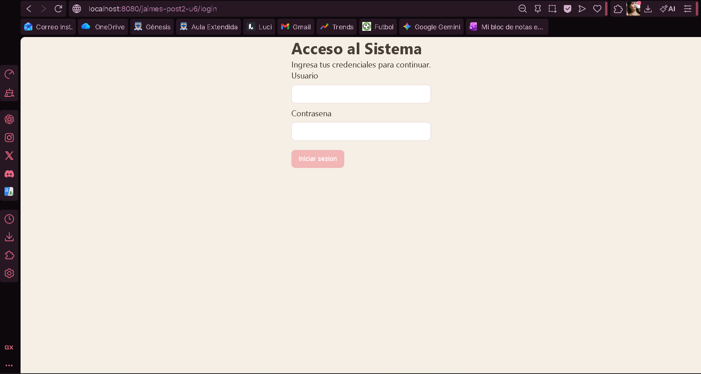
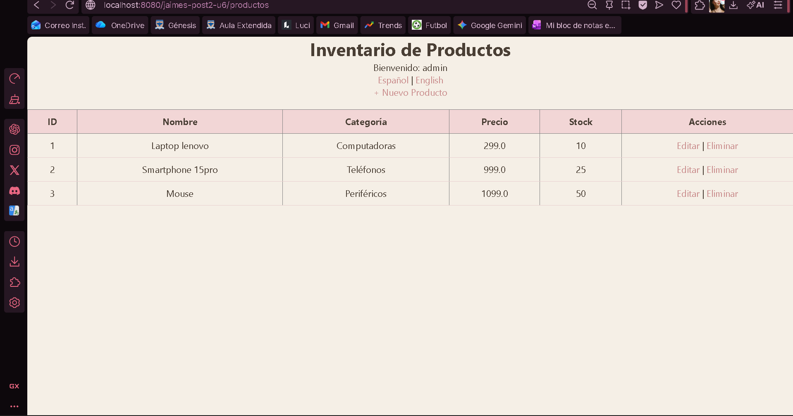
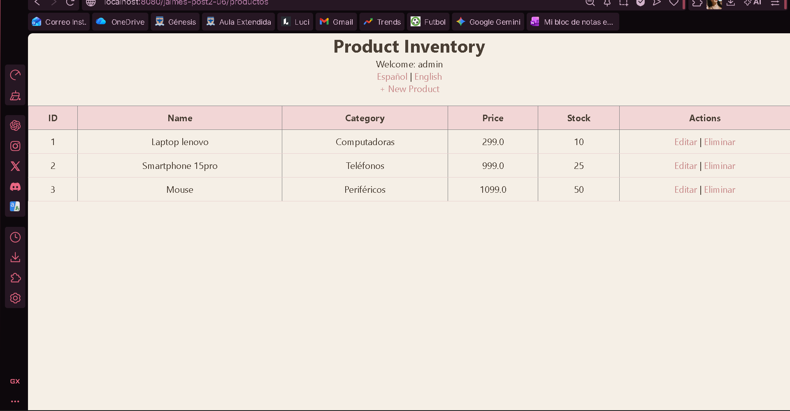
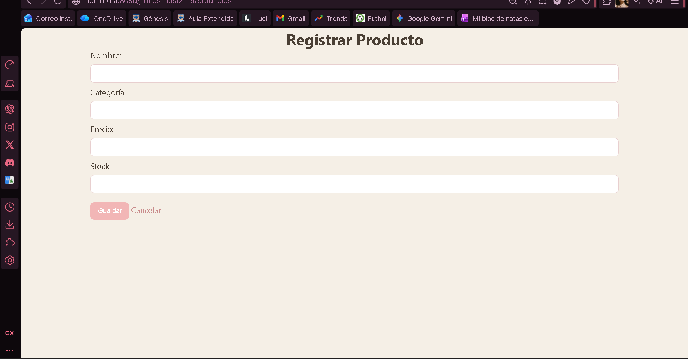

# Proyecto MVC - Gestión de Productos

Este proyecto es una aplicación web desarrollada en Java bajo el patrón de arquitectura MVC.

Permite gestionar productos mediante operaciones CRUD, autenticación de usuarios, validaciones en servidor e internacionalización (español e inglés).

---

## Descripción del sistema

El sistema incluye:

- Inicio de sesión con control de usuarios
- Gestión de productos (crear, listar, editar y eliminar)
- Validación de formularios en el servidor
- Manejo de errores por campo
- Cambio de idioma (ES / EN) mediante i18n

---

## Tecnologías utilizadas

- Java 17
- Jakarta Servlets
- JSP + JSTL
- Maven
- Apache Tomcat 10
- HTML5
- CSS3

---

## Usuarios de prueba

Usuario administrador:
- Usuario: admin
- Contraseña: admin123

Usuario visualizador:
- Usuario: viewer
- Contraseña: view456

---

## Ejecución del proyecto

1. Clonar o descargar el repositorio
2. Importar el proyecto en el IDE (IntelliJ, Eclipse o VS Code)
3. Ejecutar el servidor Apache Tomcat 10
4. Acceder a la aplicación desde:

http://localhost:8080/jaimes-post2-u6

---

## Estructura del proyecto

src/main/java  
- controller (controladores del sistema)  
- model (entidades del sistema)  
- service (lógica de negocio)  

src/main/webapp  
- css (estilos)  
- WEB-INF/views (vistas JSP)  
- index.jsp (página principal)  

src/main/resources  
- messages.properties (inglés)  
- messages_es.properties (español)  

---

## Funcionalidades principales

- Autenticación con HttpSession
- Control de acceso a rutas protegidas
- CRUD completo de productos
- Validación de datos en servidor
- Mensajes de error por campo
- Internacionalización (ES / EN)

---

## Capturas de funcionalidad

Vista principal

Lista de productos 

En ingles

Registrar producto

## Autor

Oriana Jaimes

Estudiante de ingenieria de sistemas